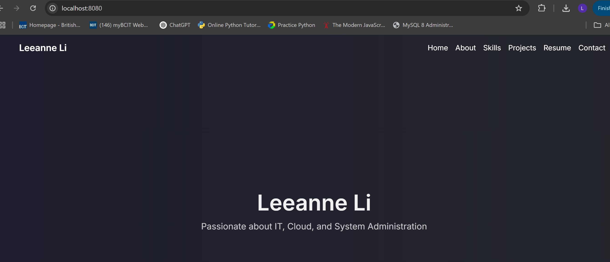
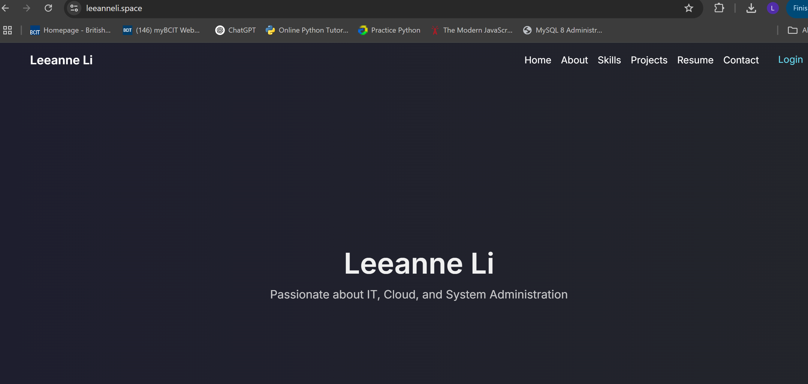

# PortfolioProject
# **Comparing Apache, Nginx, and Caddy for Web Hosting**

**Leeanne Li - ACIT 3475**

---

## **Part 1: Apache vs. Nginx vs. Caddy**

### **Introduction**
The role of web servers is crucial in delivering content efficiently across the internet. They handle requests from users, process them, and serve static or dynamic web pages accordingly. Choosing the right web server can significantly impact the performance, scalability, and security of a web application.

Three of the most widely used web servers today are Apache, Nginx, and Caddy. Each has its own strengths, weaknesses, and best use cases. Apache, one of the oldest and most established web servers, offers extensive module support and flexibility. Nginx, known for its high performance and efficient handling of concurrent connections, is widely used for reverse proxying and load balancing. Caddy, a more recent entrant, simplifies web hosting with automatic HTTPS and an easy-to-use configuration system.

This section compares these three web servers based on their performance, ease of configuration, and best use cases.
Web servers are the backbone of modern web applications, responsible for delivering web pages to users efficiently. Three major web servers dominate the industry: Apache, Nginx, and Caddy. This section compares their performance, ease of configuration, and best use cases.

### **Feature Comparison**

| Feature              | Caddy                     | Apache                     | Nginx                      |
|----------------------|--------------------------|----------------------------|----------------------------|
| **Ease of Setup**    | Very easy (Caddyfile)    | Moderate (complex .conf)   | Moderate (nginx.conf)      |
| **HTTPS**           | Automatic with Let's Encrypt | Manual setup required | Manual setup required  |
| **Performance**     | High (optimized)         | Moderate                   | High (event-driven)        |
| **Reverse Proxy**   | Built-in                  | Module-based               | Built-in                   |
| **Static Files**    | Excellent                 | Good                        | Excellent                  |
| **Resource Usage**  | Low                        | Moderate                   | Low                         |
| **Community Support** | Growing community | Large and established | Large and established |

### **Best Use Cases**
- **Caddy**: Best for small to medium websites, personal blogs, portfolios, and developers who need **automatic HTTPS**.
- **Nginx**: Ideal for high-performance applications, **load balancing**, and handling high concurrent connections.
- **Apache**: Used for **legacy applications**, enterprise environments, and sites requiring extensive modules.

### **Why Choose Caddy?**
Caddy stands out because of its **automatic HTTPS**, **simplified configuration**, and **built-in reverse proxy features**, making it an ideal choice for personal projects and cloud deployment.

**References:**
- [Caddy Documentation](https://caddyserver.com/docs/)
- [Apache HTTP Server](https://httpd.apache.org/)
- [Nginx Documentation](https://nginx.org/en/docs/)

---

## **Part 2: Configuring Caddy Locally**

### **Step 1: Installing Caddy on Windows**

1. **Download Caddy**: [Caddy Download](https://caddyserver.com/download)
2. **Move `caddy.exe` to a permanent location** (e.g., `C:\Caddy`)
3. Open **Command Prompt** and navigate to the Caddy directory:
   ```powershell
   cd C:\Caddy
   ```
4. Verify the installation:
   ```powershell
   .\caddy.exe version
   ```

### **Step 2: Configuring a Basic Caddyfile**

Create a `Caddyfile` in the `C:\Caddy` directory:

```plaintext
localhost {
    root * site
    file_server
}
```

This tells Caddy to serve files from the `site` directory when accessed via `http://localhost`.

### **Step 3: Running Caddy Locally**

1. Start Caddy:
   ```powershell
   .\caddy.exe run
   ```
2. Open a browser and visit **http://localhost** to see your site running.



### **Troubleshooting Issues**

| Issue | Cause | Solution |
|------------------|---------------------------------|--------------------------------|
| **Caddy not found** | Wrong directory | Ensure you're in the Caddy directory |
| **Port already in use** | Another process using 80/443 | Stop the process or change the port |
| **Cannot access site** | Firewall blocking access | Allow Caddy through the firewall |


## **Part 3: Deploying Caddy on AWS EC2**

### **Step 1: Launching an EC2 Instance**

1. Log into **AWS EC2** and launch an **Ubuntu** instance.
2. Choose a **t2.micro** instance (free-tier eligible).
3. Configure **Security Groups**:
   - Allow **HTTP (80)** and **HTTPS (443)**.
   - Allow **SSH (22)** for remote access.
4. Download your **.pem key** and connect via SSH:
   ```bash
   ssh -i your-key.pem ubuntu@your-ec2-ip
   ```

### **Step 2: Installing Caddy on EC2**

```bash
sudo apt update && sudo apt install -y caddy
```

Verify installation:
```bash
caddy version
```

### **Step 3: Deploying Your Website**

#### **1. Cloning Your GitHub Repository**
```bash
cd /usr/share/caddy
sudo git clone https://github-your-username .
```

#### **2. Setting Permissions**
```bash
sudo chown -R caddy:caddy /usr/share/caddy
sudo chmod -R 755 /usr/share/caddy
```

#### **3. Configuring Caddyfile for Your Domain**

Edit `/etc/caddy/Caddyfile`:
```plaintext
your-domain {
    root * /usr/share/caddy
    file_server
}
```

Restart Caddy:
```bash
sudo systemctl restart caddy
```

### **Step 4: Configuring Your Domain & SSL**

1. **Register your domain** and set DNS A records:
   - `@ → your-ip-address`
   - `www → your-ip-address`
2. **Enable HTTPS automatically** (Caddy handles this for you!)
3. Verify deployment at **[https://leeanneli.space](https://leeanneli.space)**



### **Troubleshooting AWS Deployment Issues**

| Issue | Cause | Solution |
|------------------|---------------------------------|--------------------------------|
| **Site not loading** | Security Group blocking HTTP | Open ports 80 and 443 in AWS |
| **Caddy errors on start** | Incorrect permissions | Run `sudo chown -R caddy:caddy /usr/share/caddy` |


## **Conclusion**

This report covered **Caddy’s advantages over Apache and Nginx**, how I **configured Caddy locally**, and the **deployment process on AWS EC2**, including **troubleshooting common issues**.

🚀 **Final Deployment Verification:** **[https://leeanneli.space](https://leeanneli.space)** 

